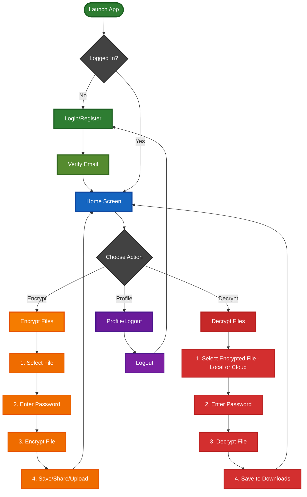
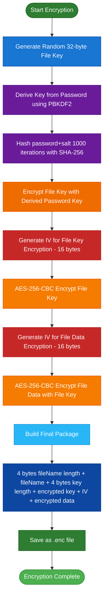
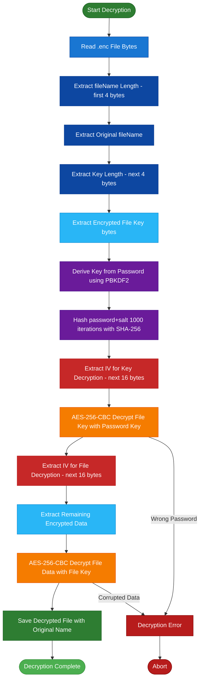

# File Cryptor - Complete Application Flow & Specs

## 🔐 Complete Application Flow



---

## 🔐 Encryption Process (Detailed Diagram)



---

## 🔓 Decryption Process (Detailed Diagram)



---

## 🔑 Key Components (Updated)

- Encryption Service

  - File Key Generation: Random 32-byte key per file (file encryption key, FEK)
  - Password Derivation:
    - Current spec: PBKDF2 with 1000 iterations (salted)
    - Note: 1000 iterations is weak by modern standards; consider increasing iterations and/or using Argon2id for better resistance to GPU attacks.
  - Encryption Algorithm:
    - Current spec: AES-256-CBC (authenticated mode recommended, e.g., AES-256-GCM)
    - For integrity protection, prefer AEAD (AES-GCM or ChaCha20-Poly1305). If CBC is used, add HMAC (e.g., HMAC-SHA256) over ciphertext and metadata.
  - Double Encryption:
    - FEK encrypts file data
    - FEK wrapped/encrypted with user-derived key (KDF result)
  - File Structure:
    - Custom container including header metadata (version, cipher, kdf, kdf_params, salt, iv/nonce, tag/mac, ciphertext, optional signature/checksum)

- Authentication Service (Supabase)

  - Email/password auth with required email confirmation
  - Session tokens, refresh handling, and auth-state stream via Supabase client
  - Resend confirmation flow, password reset

- Storage Service

  - Local storage (Downloads folder) for final decrypted/encrypted files
  - Supabase Storage integration for cloud uploads/downloads
  - Temporary file handling during streaming and chunked operations

- Database Models

EncryptedFile:

- id: UUID
- fileName: String
- filePath: String (local path or cloud URL)
- userId: String (foreign key to Users)
- uploadedAt: DateTime
- metadata: JSON (version, cipher, kdf, salt, iv, tag, chunking info, original file size, checksum)

Example JSON metadata (example):

```json
{
  "version": "1.0",
  "cipher": "AES-256-GCM",
  "kdf": "PBKDF2",
  "kdf_params": {
    "iterations": 1000,
    "salt": "base64..."
  },
  "iv": "base64...",
  "tag": "base64...",
  "chunk_size": 65536,
  "original_size": 1234567,
  "checksum": "sha256:..."
}
```

---

## 🛡️ Security Features (Summary & Recommendations)

1. Double Encryption
   - FEK (random per file) + FEK wrapped with user-derived key
2. Password Security
   - PBKDF2 currently with 1000 iterations (salted)
   - Recommendation: Raise iterations (e.g., 100k+) or switch to Argon2id with memory and time cost parameters
3. Encryption Mode
   - Current: AES-256-CBC — ensure you include HMAC for integrity, or migrate to AEAD (AES-GCM / ChaCha20-Poly1305)
4. Email Verification & Session Management
   - Email verification before access
   - Automatic logout on token expiry
   - Secure token storage (OS-backed secure storage)
5. Metadata & Versioning
   - Embed explicit version numbers so future changes to format and algorithms remain compatible

---

## 📱 User Experience Flow (Concise)

Login → Home Screen (3 Tabs)
├─ Encrypt: Pick File → Set Password → Encrypt → Save/Share/Upload  
├─ Decrypt: Pick File/Cloud File → Enter Password → Decrypt → Save  
└─ Profile: View Info → Logout
