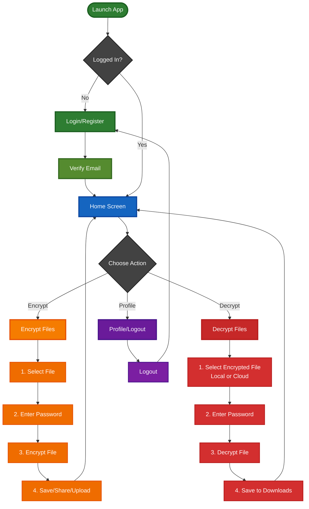

# File Cryptor - Complete Application Flow Diagram

## 🔐 Complete Application Flow



## 📋 Detailed Flow Descriptions

### 1. **Authentication Flow**

```

## 🔑 Key Components

### **Encryption Service**

- **File Key Generation**: Random 32-byte key per file
- **Password Derivation**: PBKDF2 with 1000 iterations
- **Encryption Algorithm**: AES-256 CBC mode
- **File Structure**: Custom format with embedded metadata

### **Authentication Service (Supabase)**

- User registration with email confirmation
- Email/password authentication
- Session management
- Auth state streaming

### **Storage Service**

- Local file storage (Downloads folder)
- Supabase Storage for cloud uploads
- Temporary file handling

### **Database Models**

```

EncryptedFile:

- id (UUID)
- fileName (String)
- filePath (String)
- userId (String)
- uploadedAt (DateTime)
- metadata (String, optional)

```

## 🛡️ Security Features

1. **Double Encryption**:

   - Random file key per file
   - File key encrypted with user password

2. **Password Security**:

   - PBKDF2 key derivation
   - 1000 iterations
   - Salted hashing

3. **Email Verification**:

   - Required before access
   - Resend capability

4. **Session Management**:
   - Automatic logout on token expiry
   - Secure token storage

## 📱 User Experience Flow

```

Login → Home Screen (3 Tabs)
├─ Encrypt: Pick File → Set Password → Encrypt → Save/Share/Upload
├─ Decrypt: Pick File/Cloud File → Enter Password → Decrypt → Save
└─ Profile: View Info → Logout

```

---

**Note**: All file operations maintain original filenames and extensions through the encryption/decryption cycle.
```
