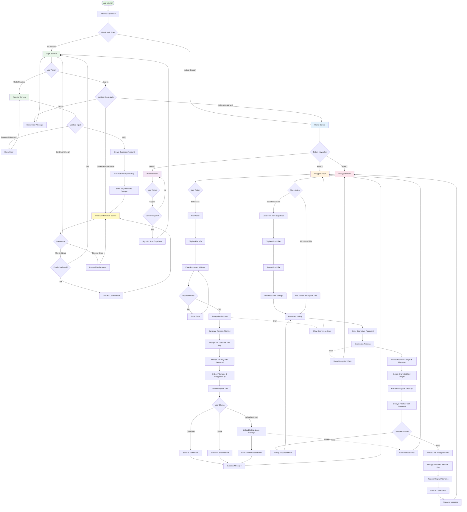

# File Cryptor - Complete Application Flow Diagram

## 🔐 Complete Application Flow



## 📋 Detailed Flow Descriptions

### 1. **Authentication Flow**
```
Start → Initialize Supabase → Check Auth State
    ├─ No Session → Login Screen
    │   ├─ Enter Credentials → Validate
    │   │   ├─ Invalid → Error Message
    │   │   ├─ Valid (Unconfirmed) → Email Confirmation
    │   │   └─ Valid (Confirmed) → Home Screen
    │   └─ Sign Up → Register Screen
    │       ├─ Validate Input (Password Match, etc.)
    │       ├─ Create Account in Supabase
    │       ├─ Generate User Encryption Key
    │       ├─ Store in Secure Storage
    │       └─ Email Confirmation Screen
    │
    └─ Active Session → Home Screen
```

### 2. **Email Confirmation Flow**
```
Email Confirmation Screen
    ├─ Check Status → Verify with Supabase
    │   ├─ Confirmed → Redirect to Login
    │   └─ Not Confirmed → Wait
    ├─ Resend Confirmation → Send New Email
    └─ Continue to Login → Go to Login Screen
```

### 3. **Home Screen Navigation**
```
Home Screen (Bottom Navigation)
    ├─ Encrypt Tab (Index 0) → Encrypt Screen
    ├─ Decrypt Tab (Index 1) → Decrypt Screen
    └─ Profile Tab (Index 2) → Profile Screen
```

### 4. **Encryption Flow (Detailed)**
```
Encrypt Screen
    └─ Select File
        └─ File Picker → Display File Info
            └─ Enter Password (min 6 chars)
                └─ Enter Notes (Optional)
                    └─ Encrypt Button
                        ├─ Generate Random 32-byte File Key
                        ├─ Encrypt File Data with AES-CBC (File Key)
                        ├─ Derive Password Key using PBKDF2
                        ├─ Encrypt File Key with Password Key
                        ├─ Build Structure:
                        │   [4 bytes: filename length]
                        │   [filename bytes]
                        │   [4 bytes: encrypted key length]
                        │   [encrypted key bytes]
                        │   [16 bytes: IV]
                        │   [encrypted file data]
                        └─ Save Encrypted File
                            ├─ Download → Save to Downloads Folder
                            ├─ Share → System Share Sheet
                            └─ Upload to Cloud
                                ├─ Upload to Supabase Storage
                                └─ Save Metadata to Database
```

### 5. **Decryption Flow (Detailed)**
```
Decrypt Screen
    ├─ Pick Local File
    │   └─ File Picker
    │       └─ Password Dialog
    │
    └─ Select Cloud File
        └─ Load from Supabase Database
            └─ Display List of Encrypted Files
                └─ Select File → Download from Storage
                    └─ Password Dialog
                        └─ Decryption Process:
                            ├─ Read Encrypted File Bytes
                            ├─ Extract: [filename length] (4 bytes)
                            ├─ Extract: [filename] (variable)
                            ├─ Extract: [encrypted key length] (4 bytes)
                            ├─ Extract: [encrypted key bytes] (variable)
                            ├─ Extract: [IV] (16 bytes)
                            ├─ Extract: [encrypted data] (remaining)
                            ├─ Derive Password Key (PBKDF2)
                            ├─ Decrypt File Key using Password Key
                            ├─ Decrypt File Data using File Key & IV
                            ├─ Restore Original Filename
                            └─ Save to Downloads
                                └─ Success Message
```

### 6. **Profile Flow**
```
Profile Screen
    ├─ Display User Email
    ├─ Display Member Since Date
    └─ Logout Button
        └─ Confirmation Dialog
            ├─ Cancel → Stay on Profile
            └─ Confirm → Sign Out
                └─ Redirect to Login Screen
```

## 🔑 Key Components

### **Encryption Service**
- **File Key Generation**: Random 32-byte key per file
- **Password Derivation**: PBKDF2 with 1000 iterations
- **Encryption Algorithm**: AES-256 CBC mode
- **File Structure**: Custom format with embedded metadata

### **Authentication Service (Supabase)**
- User registration with email confirmation
- Email/password authentication
- Session management
- Auth state streaming

### **Storage Service**
- Local file storage (Downloads folder)
- Supabase Storage for cloud uploads
- Temporary file handling

### **Database Models**
```
EncryptedFile:
  - id (UUID)
  - fileName (String)
  - filePath (String)
  - userId (String)
  - uploadedAt (DateTime)
  - metadata (String, optional)
```

## 🛡️ Security Features

1. **Double Encryption**:
   - Random file key per file
   - File key encrypted with user password

2. **Password Security**:
   - PBKDF2 key derivation
   - 1000 iterations
   - Salted hashing

3. **Email Verification**:
   - Required before access
   - Resend capability

4. **Session Management**:
   - Automatic logout on token expiry
   - Secure token storage

## 📱 User Experience Flow

```
Login → Home Screen (3 Tabs)
    ├─ Encrypt: Pick File → Set Password → Encrypt → Save/Share/Upload
    ├─ Decrypt: Pick File/Cloud File → Enter Password → Decrypt → Save
    └─ Profile: View Info → Logout
```

---

**Note**: All file operations maintain original filenames and extensions through the encryption/decryption cycle.